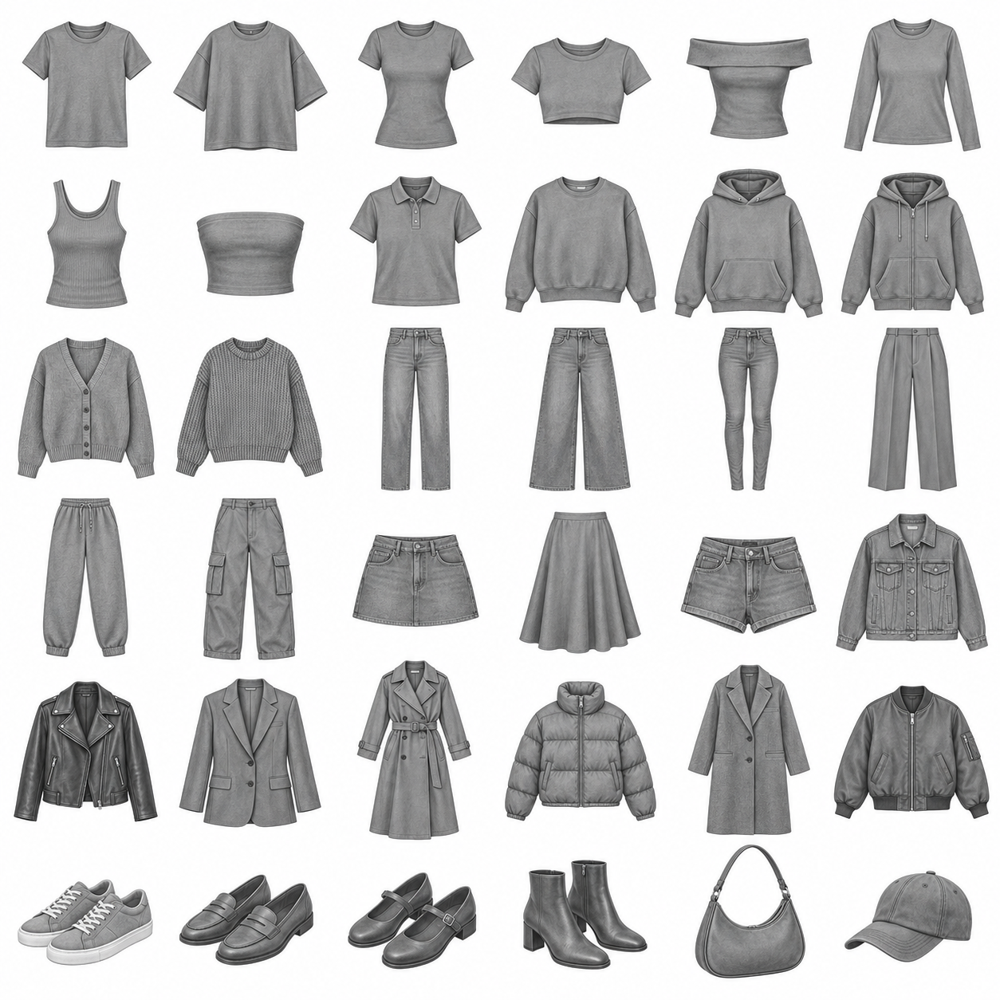

# Wearwell

**Your wardrobe learns your taste.**

Wearwell is a consumer wardrobe prototype with focused, app-like onboarding on mobile and desktop: select familiar silhouettes and their colors, rate outfits, discover what those decisions have in common, and make better combinations from clothes you already own. Its second core feature identifies missing archetypes by the **preference-weighted new outfits** they can unlock.

This project lives in a private GitHub repository. It is an independent implementation, not a fork of Cher's Closet.

## The problem

A closet inventory does not tell you why some combinations feel like you and others do not. Wearwell focuses on that gap: learning from decisions about complete outfits, without requiring photos of every garment, a long style questionnaire, shopping links, or a fashion chatbot.

## A three-minute demo

1. Start with **Build my closet**. Optional seasonal favorites come first: knit, trench, knee-high boots, puffer, wool coat and scarf. Then choose everyday silhouettes and their colors; each silhouette/color combination becomes a separate piece.
2. With eight pieces covering tops, bottoms and shoes, choose **Start with these →**. Optional sections remain skippable; smaller closets can also finish once the essentials are covered. Choose **Dress for today**, enter the low/high in Celsius or Fahrenheit, and select a comfort preference. Your weather outfit includes a short explanation of what to wear at the low and remove at the high. **Teach Wearwell my style** then opens Swipe & Learn.
3. Rate five deliberately varied outfits with **Love this** or **Not for me**. Dislike reasons are optional.
4. Read **We learned something about you**. These insights are computed from those exact ratings, including an honest empty state when a signal is missing.
5. Continue to a batch ranked by the learned profile. Rate another outfit to populate the before/after acceptance comparison.
6. Open **Outfits**, choose **Going out**, and click **Style me**. Select a garment and **Swap this**; other pieces stay in place. Save the look.
7. Open **My style** to inspect preference dimensions and the underlying evidence.
8. Open **Missing** to compare three gaps and preview up to three unlocked outfits. Only the dashed garment is hypothetical.
9. Refresh: closet, feedback, learned profile, saved/generated outfits and onboarding survive.

**My style → Start a fresh demo** resets this browser's data after confirmation. Starter clothing is seeded only on request; feedback and preferences are never pre-seeded.

First-time setup hides all product navigation, catalog, search, filters and dashboard content. It uses one question per screen, large garment choices, a simple progress indicator, Back and a fixed bottom action. Both selections and the current step survive refresh. Full product navigation appears after setup completion; returning users can manage their inventory in Closet.

## Screens and visual system

The interface uses cream paper, tomato-red controls, editorial serif typography and original clothing illustrations. Desktop and 390px mobile layouts were manually checked.

| Screen        | Preview / screenshot placeholder                                          |
| ------------- | ------------------------------------------------------------------------- |
| First-time setup | Welcome, silhouette choices, individual colors, optional extras, closet payoff |
| Today         | Low/high input, personal cold tolerance, weather outfit and editable piece guides |
| Closet        | Clothing grid, category and fit filters, color swatches, owned-item count |
| Swipe & Learn | Flat-lay card, optional reasons, fifth-rating insight transition          |
| Outfit studio | Occasion picker, owned-clothing rail, single-item swap, saved looks       |
| Style DNA     | Evidence-based dimensions, interpretable insights, acceptance comparison  |
| Missing       | Three ranked gaps, estimated counts and dashed hypothetical garments      |

These are explicit screenshot placeholders; the live application is the interactive preview. Original asset preview:



## Local setup

Requires **Node.js 22.16+** (verified with Node 24) and npm.

```sh
git clone https://github.com/crisguooo/personalized-ai-wardrobe.git
cd personalized-ai-wardrobe
npm ci
npm run dev
```

The development command starts Vite and the optional summary API together. Open the localhost URL printed by Vite, normally `http://127.0.0.1:5173`. GitHub authentication is required to clone this private repository.

```sh
npm test              # deterministic engine/storage/provider tests
npm run build         # production client build in dist/
npm run preview       # static client preview
npm run server        # optional API alone
npm run format:check  # source formatting
```

`preview` serves the static client; configure a same-origin `/api` proxy to the Node service if testing live summaries outside Vite development. Core recommendations, insights and gaps work without any AI provider.

## Architecture

```text
src/data/catalog.js       Canonical metadata, 38 archetypes × 8 colors
src/data/thermal.js       Editable starting temperature ranges and layer insulation
src/components/          Shared garment renderer, flat-lay composition
src/engine/wardrobe.js    Validity → candidates → features → preferences → ranking
src/engine/onboarding.js  Essential-first setup groups, resumable draft, early entry
src/engine/weather.js     Unit conversion, personal comfort, low/high outfit scoring
src/services/storage.js  Versioned localStorage repository and validation
src/services/analytics.js Local event abstraction, bounded to 500 entries
src/services/ai.js       Same-origin summary request
src/App.jsx              Shared state, persistence lifecycle and navigation
src/pages/               Closet, guided feedback, studio, style and missing views
server/provider.js       Provider-neutral summary boundary with no-key fallback
server/index.js          Local HTTP API; provider secrets stay server-side
tests/engine.test.js      Core non-visual tests
tests/onboarding.test.js  Early entry, optional categories, draft persistence, migration
tests/weather.test.js     Units, seasonal entry, layering, comfort and thermal persistence
docs/REFERENCE_REVIEW.md  Upstream inspection, reuse decisions, original plan
```

The application owns one shared state rather than separate storage-backed state per page. Hash navigation supports refresh and browser Back without server rewrite rules. The storage adapter is the migration boundary for a future backend. Feedback is the source of truth: a stored profile is recomputed and validated on load.

### Clothing metadata and visuals

Every variant has a stable ID, archetype, category, subcategory, color, fit, neckline, length, style tags, layer, warmth, formality and asset key. There are no branded SKUs or copied personal wardrobe records.

The original generated 6×6 atlas is addressed through `illustrationMap`. SVG color matrices tint its grayscale cells while retaining the white background for multiply compositing; they do not draw garments. This keeps variants cohesive and avoids 288 separate downloads. Replace the renderer/registry with individually illustrated transparent PNGs later without changing recommendation data. The generation prompt is in [docs/wardrobe-atlas-prompt.txt](docs/wardrobe-atlas-prompt.txt).

Knee-high boots and the scarf use original local SVG illustrations alongside the 36-cell atlas, with the same color treatment.

### Outfit generation

Hard constraints require exactly one top, one bottom and one pair of shoes, with at most one mid-layer, outer layer and accessory. Unknown IDs, duplicates, unowned items and physically bulky layering are rejected. Personal taste is a soft signal, separate from validity; fitted-on-fitted is allowed if the user likes it.

Generation is a deterministic bounded sample of up to 900 candidates. Initial exploration maximizes feature and item diversity. Learned ranking combines preference scores with an occasion prior. Local refinements favor candidates changing the fewest pieces. **Swap this** substitutes exactly one owned item from the same category and revalidates the result.

### Weather and personal comfort

Today accepts a manually entered daily low and high in either unit; switching units converts existing inputs. Temperatures are stored canonically in Celsius with a local date. Opening Today on a new day asks for an updated forecast. No location permission or weather service is required.

Each of the 304 variants inherits an editable temperature guide. Top ranges describe the base without extra layers; removable midlayers, coats and scarves contribute estimated insulation. The weather engine assesses the low with the full outfit and the high across combinations of removable layers, then uses style preference as a secondary signal. It only uses owned clothes. Scarves are explicitly considered alongside available outfits, and alternate Today looks stay near the best weather fit.

Users may choose default guidance, feeling cold easily, running warm, or their own temperature at which they want a heavy coat. The custom threshold also discourages removing that coat while the temperature remains at or below it. Individual variant ranges can be edited in the outfit's expandable guides and survive refresh. Today's weather also informs Swipe & Learn and outfit studio ranking; saved looks remain user choices.

The explanation describes the selected garments and suggested layer removal, rather than claiming live wind or rain data. If available pieces leave a substantial warmth mismatch, it says so. Ranges and insulation are product heuristics, not measured fabric performance or universal comfort standards; wind, rain, activity and actual garment construction are not modeled.

### Preference learning

No training or fine-tuning. Feature extraction describes silhouettes, color palettes, style tags, layering, formality and combinations such as fitted-top/loose-bottom and matching sweats.

- Likes add positive weighted evidence for present features.
- Explicit dislike reasons update only the relevant dimensions.
- Unexplained dislikes primarily penalize the top–bottom archetype pairing and weakly update present composition patterns. They never blacklist every garment or color in the outfit.
- Evidence is shrunk toward neutral with a prior; weights are bounded to `[-1, 1]`.
- A deterministic preference score ranks valid candidates. A displayed score is an uncalibrated heuristic, **not a probability**.
- Insights use actual positive/negative weights; missing evidence is displayed as unknown. Style DNA exposes the full profile for inspection.

### Wardrobe-gap algorithm

For each not-owned archetype, evaluate one canonical color and generate up to 300 valid hypothetical outfits that **must include that candidate**. Every other piece must already be owned.

With feedback, the high-preference threshold is the larger of `0.55` and the current closet's 65th-percentile preference score minus `0.03`. Without feedback it is neutral (`0.50`), and the UI explains that estimates are not personalized yet.

The ranking value is the **sum of preference scores for newly unlocked outfits above that threshold**. This combines useful volume with preference, instead of ranking by raw combinatorial count. Each card shows sampled count, likely count, compatible owned pieces and three diverse qualifying previews where available. Estimates are bounded samples, not exhaustive counts or validated predictions of what a person will wear.

### AI usage and environment variables

The primary product is deterministic and usable without keys. The optional **Put my style into words** action goes through the Node API. It returns an evidence-grounded deterministic summary by default. An Anthropic implementation can turn the same evidence into a short explanation.

Copy `.env.example` to `.env` locally if enabling the provider:

| Variable            | Purpose                                                        |
| ------------------- | -------------------------------------------------------------- |
| `AI_PROVIDER`       | `none` by default; `anthropic` opts into live summaries        |
| `ANTHROPIC_API_KEY` | Server-only secret; never use a `VITE_` prefix                 |
| `ANTHROPIC_MODEL`   | Explicit model available to your Anthropic account             |
| `API_PORT`          | Local API port, default `3001`; match Vite's proxy if changing |

Only the selected preference labels go to the model, not the closet inventory or feedback history. The LLM does not determine ownership, validity, outfit selection, gap counts or preference weights. Provider calls have a timeout and a deterministic fallback for rejected responses. The API binds to loopback and is intended for local development; a hosted deployment needs a same-origin API boundary and appropriate access/rate controls. No live paid model call was made during development.

### Persistence and instrumentation

`wearwell:v1` stores selected IDs, every feedback event, profile, saved looks, the latest 60 generated looks, the in-progress onboarding draft and completion/insight flags. Existing completed users retain their normal product experience. Storage errors produce a visible notice. Unknown catalog entries and invalid saved outfit ownership are removed on load. Removing an owned piece invalidates saved/generated outfits containing it, while historical feedback remains for taste learning.

Events include closet additions/completion, outfit views, likes/dislikes, reason selection, profile generation, personalized generation, swaps and missing-item exploration. They stay local; no analytics provider or network telemetry is connected. Style DNA displays observed acceptance before/after personalization. Those tiny-sample figures are descriptive, not proof of model accuracy.

## Verification

Run `npm test` for catalog validation, hard outfit rules, owned-only generation, diverse exploration, reason-targeted updates, opposite-persona ranking, improved learned scores, exact one-item swaps, preference-weighted missing items, persistence/corruption/quota handling and the no-key server fallback.

The browser demo was manually exercised through selection, five feedback actions, real insights, personalized recommendations, occasion generation, swapping, saving, reload, style summary and gap previews. See [docs/QA.md](docs/QA.md) for the final verification record.

## Current limitations

- Local single-browser prototype: no accounts, sync or deployment configured.
- 38 representative archetypes, not every example in the original brief; shoe and accessory variety can expand.
- Atlas cells and tinting are approximation artwork; long garments may have tight crop margins. Per-item transparent assets are the natural next step.
- Occasion, compatibility and preference scores are explainable heuristics, not a professionally validated styling model. A small closet limits variety, and five ratings yield tentative signals.
- Gap search uses a fixed canonical color for each missing archetype and bounded combinations; it does not search every possible color or guarantee the global optimum.
- Live Anthropic calls are optional and were not exercised without credentials. The shipped experience does not depend on them.
- Fonts are requested from Google Fonts with local system fallbacks.

## Future directions

Improve evidence confidence and exploration, add better transparent garment artwork and selected archetypes, validate suggestions with real wearer feedback, add a storage backend behind the existing adapter, and evaluate optional provider summaries. Shopping, brands, prices, packing, virtual try-on, social feeds and custom model training remain outside this MVP.

## Attribution

[Cher's Closet](https://github.com/hastalasophia/chers-closet), designed and built by **Sophia Liu**, inspired the image-led closet browsing and flat-lay outfit interaction. Its README, CLAUDE.md, source, data model, illustration loader and Magic Build prompt were inspected before implementation.

No upstream application code, personal dataset, illustration, icon, font or personal styling prompt was copied. The inspected reference repository had no license file; public availability was not treated as a license grant. Wearwell's product loop, code, metadata, learning engine, gap algorithm and generated garment atlas were created for this project. Third-party npm packages and fonts retain their respective licenses.
